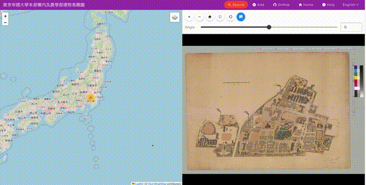
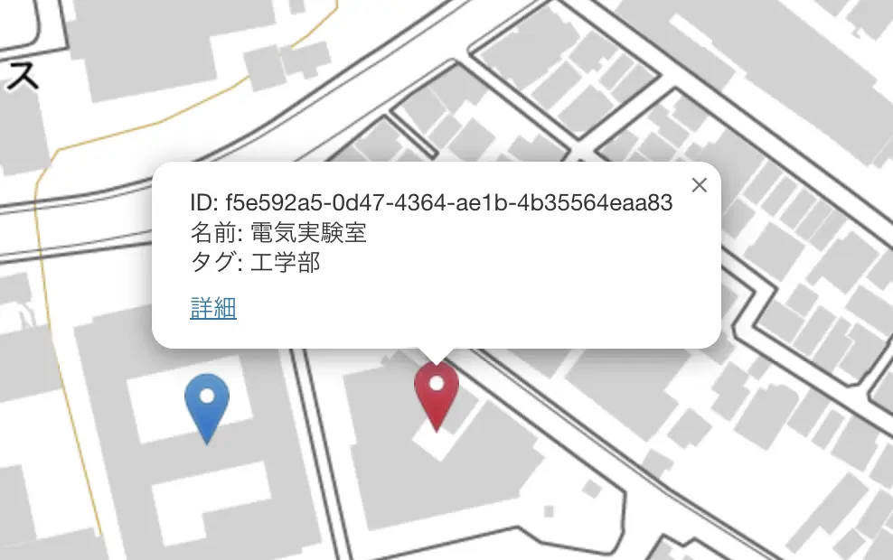
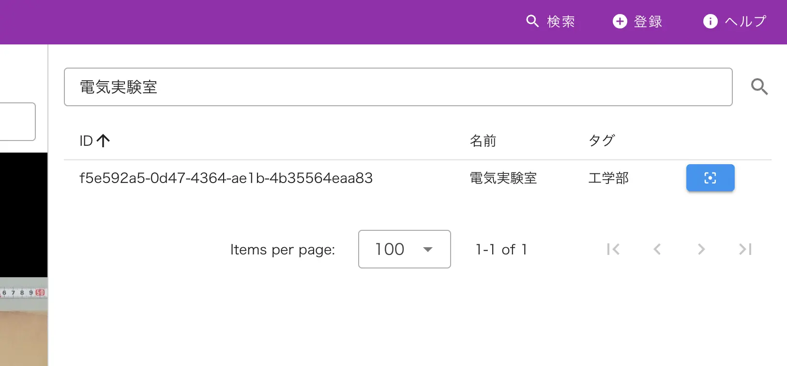

# IIIF Georeference Viewer

IIIF Viewer with [IIIF Georeference Extension](https://iiif.io/api/extension/georef/)



## 🌐 Website

[Visit the demo page](https://nakamura196.github.io/iiif_geo/) to try it out.

## 📖 Data

Prepare a JSON file following the Full Canvas Example of the Georeference Extension.

https://iiif.io/api/extension/georef/#41-full-canvas-example

The JSON file used on the demo site is as follows.

https://nakamura196.github.io/iiif_geo/canvas.json

### Extra metadata fields

Extra metadata fields can be added to the Feature data.

```json
{
    "type": "Feature",
    "properties": {
        "resourceCoords": [
            6690,
            7517
        ]
    },
    "geometry": {
        "type": "Point",
        "coordinates": [
            139.7623182,
            35.7151233
        ]
    },
    "metadata": {
        "id": "http://example.org/dJdXXQEA8dWSptgt8",
        "label": "電気実験室",
        "tags": ["工学部"],
        "url": "https://maps.app.goo.gl/dJdXXQEA8dWSptgt8",
        "xywh": "5936,6344,976,1384",
    }
}
```

The `metadata` field is used to display the label, tags, and URL of the place.

| Field | Description | Required | Format |
| ---- | ---- | ---- | ---- |
| id | URI of the place | False | String |
| label | Label of the place | False | String |
| tags | Tags of the place | False | Array |
| url | URL of the place | False | String |
| xywh | XYWH region of the place | False | String |

These fields are used for the popup of the marker and the search function.

#### Example

https://nakamura196.github.io/iiif_geo/canvas_extra.json

#### Marker popup



#### Search



## Setup

Make sure to install the dependencies:

```bash
# npm
npm install

# pnpm
pnpm install

# yarn
yarn install
```

## Development Server

Start the development server on `http://localhost:3000`:

```bash
# npm
npm run dev

# pnpm
pnpm run dev

# yarn
yarn dev
```

## Production

Build the application for production:

```bash
# npm
npm run build

# pnpm
pnpm run build

# yarn
yarn build
```

Locally preview production build:

```bash
# npm
npm run preview

# pnpm
pnpm run preview

# yarn
yarn preview
```

Check out the [deployment documentation](https://nuxt.com/docs/getting-started/deployment) for more information.
