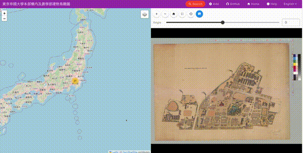
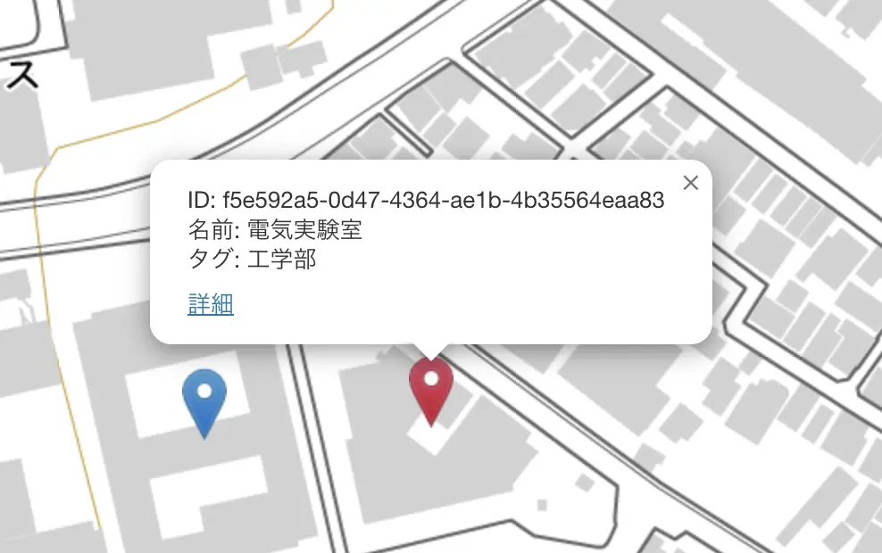
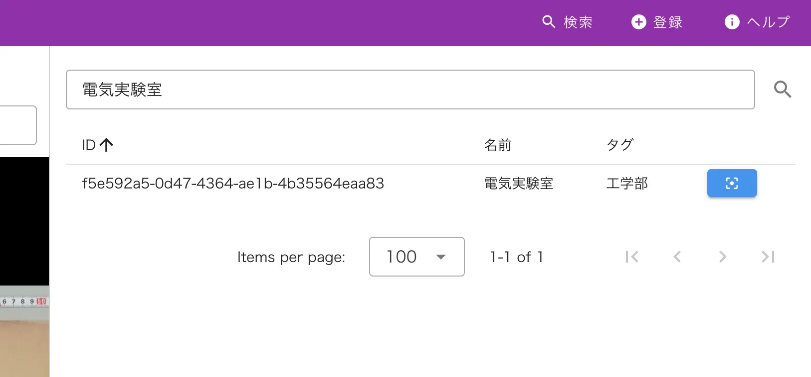

# IIIF Georeference Viewer

IIIF Viewer with [IIIF Georeference Extension](https://iiif.io/api/extension/georef/)

[English](#english) | [日本語](#日本語)



---

## English

### 📺 Introduction

[](https://www.youtube.com/watch?v=RoE5Mm6vSFE)

### 🌐 Website

[Visit the demo page](https://nakamura196.github.io/iiif_geo/) to try it out.

### 📖 Data

This viewer supports two types of IIIF data formats:

#### 1. IIIF Canvas with Georeference Extension

Prepare a JSON file following the Full Canvas Example of the Georeference Extension.

https://iiif.io/api/extension/georef/#41-full-canvas-example

Example Canvas file:
- https://nakamura196.github.io/iiif_geo/canvas.json
- https://nakamura196.github.io/iiif_geo/canvas_extra.json

#### 2. IIIF Manifest with Georeference Extension

You can also use a full IIIF Presentation API 3.0 Manifest that includes one or more Canvases with georeference annotations.

Example Manifest file:
- https://nakamura196.github.io/iiif_geo/manifest.json

The viewer will automatically detect whether the provided URL is a Manifest or a Canvas and display the georeferenced content accordingly.

#### Extra metadata fields

Extra metadata fields can be added to the Feature data. This viewer supports [Linked Places Format (LPF)](https://github.com/LinkedPasts/linked-places-format) compatible structure.

##### Recommended Format (Linked Places Format)

```json
{
    "type": "Feature",
    "@id": "https://example.org/places/denki-jikkenshitsu",
    "properties": {
        "resourceCoords": [6690, 7517],
        "title": "電気実験室",
        "tags": ["工学部"],
        "xywh": "5936,6344,976,1384"
    },
    "links": [
        {
            "type": "primaryTopicOf",
            "identifier": "https://maps.app.goo.gl/dJdXXQEA8dWSptgt8"
        },
        {
            "type": "closeMatch",
            "identifier": "http://www.wikidata.org/entity/Q123"
        }
    ],
    "geometry": {
        "type": "Point",
        "coordinates": [139.7623182, 35.7151233]
    }
}
```

| Field | Location | Description | Required |
| ---- | ---- | ---- | ---- |
| @id | Feature level | URI identifier (LPF/JSON-LD compatible) | False |
| title | properties | Title/label of the place | False |
| tags | properties | Tags for categorization | False |
| xywh | properties | XYWH region on the image | False |
| links | Feature level | Related links (LPF format) | False |

###### Link Types (Linked Places Format)

| Type | Description |
| ---- | ---- |
| closeMatch | Similar resource in another dataset |
| exactMatch | Identical resource in another dataset |
| primaryTopicOf | Web page about this place |
| subjectOf | Document mentioning this place |
| seeAlso | Related resource |

#### Legacy Format (still supported)

For backwards compatibility, the `metadata` object format is still supported:

```json
{
    "type": "Feature",
    "properties": {
        "resourceCoords": [6690, 7517]
    },
    "geometry": {
        "type": "Point",
        "coordinates": [139.7623182, 35.7151233]
    },
    "metadata": {
        "id": "http://example.org/dJdXXQEA8dWSptgt8",
        "label": "電気実験室",
        "tags": ["工学部"],
        "url": "https://maps.app.goo.gl/dJdXXQEA8dWSptgt8",
        "xywh": "5936,6344,976,1384"
    }
}
```

| Field | Description | Required |
| ---- | ---- | ---- |
| id | URI of the place | False |
| label | Label of the place | False |
| tags | Tags of the place | False |
| url | URL of the place | False |
| xywh | XYWH region of the place | False |

These fields are used for the popup of the marker and the search function.

#### Example

https://nakamura196.github.io/iiif_geo/canvas_extra.json

#### Marker popup



#### Search



### Setup

Make sure to install the dependencies:

```bash
# npm
npm install

# pnpm
pnpm install

# yarn
yarn install
```

### Development Server

Start the development server on `http://localhost:3000`:

```bash
# npm
npm run dev

# pnpm
pnpm run dev

# yarn
yarn dev
```

### Production

Build the application for production:

```bash
# npm
npm run build

# pnpm
pnpm run build

# yarn
yarn build
```

Locally preview production build:

```bash
# npm
npm run preview

# pnpm
pnpm run preview

# yarn
yarn preview
```

Check out the [deployment documentation](https://nuxt.com/docs/getting-started/deployment) for more information.

---

## 日本語

IIIF [Georeference Extension](https://iiif.io/api/extension/georef/) に対応した IIIF ビューアです。

### 📺 紹介動画

[](https://www.youtube.com/watch?v=3qsZbPXC9qg)

### 🌐 ウェブサイト

[デモページ](https://nakamura196.github.io/iiif_geo/) で実際にお試しいただけます。

### 📖 データ

本ビューアは 2 種類の IIIF データ形式に対応しています。

#### 1. Georeference Extension 付きの IIIF Canvas

Georeference Extension の Full Canvas Example に従った JSON ファイルを用意します。

https://iiif.io/api/extension/georef/#41-full-canvas-example

Canvas ファイルの例:
- https://nakamura196.github.io/iiif_geo/canvas.json
- https://nakamura196.github.io/iiif_geo/canvas_extra.json

#### 2. Georeference Extension 付きの IIIF Manifest

ジオリファレンスのアノテーションを含む 1 つ以上の Canvas を持つ、IIIF Presentation API 3.0 の Manifest も利用できます。

Manifest ファイルの例:
- https://nakamura196.github.io/iiif_geo/manifest.json

ビューアは、指定された URL が Manifest か Canvas かを自動的に判定し、ジオリファレンスされたコンテンツを表示します。

#### 追加メタデータフィールド

Feature データには追加のメタデータフィールドを付与できます。本ビューアは [Linked Places Format (LPF)](https://github.com/LinkedPasts/linked-places-format) 互換の構造に対応しています。

##### 推奨フォーマット（Linked Places Format）

```json
{
    "type": "Feature",
    "@id": "https://example.org/places/denki-jikkenshitsu",
    "properties": {
        "resourceCoords": [6690, 7517],
        "title": "電気実験室",
        "tags": ["工学部"],
        "xywh": "5936,6344,976,1384"
    },
    "links": [
        {
            "type": "primaryTopicOf",
            "identifier": "https://maps.app.goo.gl/dJdXXQEA8dWSptgt8"
        },
        {
            "type": "closeMatch",
            "identifier": "http://www.wikidata.org/entity/Q123"
        }
    ],
    "geometry": {
        "type": "Point",
        "coordinates": [139.7623182, 35.7151233]
    }
}
```

| フィールド | 場所 | 説明 | 必須 |
| ---- | ---- | ---- | ---- |
| @id | Feature レベル | URI 識別子（LPF/JSON-LD 互換） | False |
| title | properties | 場所のタイトル・ラベル | False |
| tags | properties | 分類用のタグ | False |
| xywh | properties | 画像上の XYWH 領域 | False |
| links | Feature レベル | 関連リンク（LPF 形式） | False |

###### リンクタイプ（Linked Places Format）

| タイプ | 説明 |
| ---- | ---- |
| closeMatch | 別データセットの類似リソース |
| exactMatch | 別データセットの同一リソース |
| primaryTopicOf | この場所に関する Web ページ |
| subjectOf | この場所に言及する文献 |
| seeAlso | 関連リソース |

#### レガシーフォーマット（引き続き対応）

後方互換性のため、`metadata` オブジェクト形式も引き続き利用できます。

```json
{
    "type": "Feature",
    "properties": {
        "resourceCoords": [6690, 7517]
    },
    "geometry": {
        "type": "Point",
        "coordinates": [139.7623182, 35.7151233]
    },
    "metadata": {
        "id": "http://example.org/dJdXXQEA8dWSptgt8",
        "label": "電気実験室",
        "tags": ["工学部"],
        "url": "https://maps.app.goo.gl/dJdXXQEA8dWSptgt8",
        "xywh": "5936,6344,976,1384"
    }
}
```

| フィールド | 説明 | 必須 |
| ---- | ---- | ---- |
| id | 場所の URI | False |
| label | 場所のラベル | False |
| tags | 場所のタグ | False |
| url | 場所の URL | False |
| xywh | 場所の XYWH 領域 | False |

これらのフィールドは、マーカーのポップアップと検索機能で使用されます。

#### 例

https://nakamura196.github.io/iiif_geo/canvas_extra.json

#### マーカーのポップアップ


#### 検索


### セットアップ

依存関係をインストールします。

```bash
# npm
npm install

# pnpm
pnpm install

# yarn
yarn install
```

### 開発サーバー

`http://localhost:3000` で開発サーバーを起動します。

```bash
# npm
npm run dev

# pnpm
pnpm run dev

# yarn
yarn dev
```

### 本番ビルド

本番用にアプリケーションをビルドします。

```bash
# npm
npm run build

# pnpm
pnpm run build

# yarn
yarn build
```

本番ビルドをローカルでプレビューします。

```bash
# npm
npm run preview

# pnpm
pnpm run preview

# yarn
yarn preview
```

詳細は [デプロイのドキュメント](https://nuxt.com/docs/getting-started/deployment) を参照してください。
